# Movie Industry Exploratory Data Analysis: A Roadmap for Success

## Project Overview
Our hypothetical company is embarking on an ambitious venture to establish a new movie studio, entering the vibrant yet competitive film industry with no prior expertise. This project adapts an existing analysis by collecting, cleaning, and refining movie data from diverse sources, originally sourced from another repository. The resulting recommendations will optimize profitability, audience appeal, and industry recognition, positioning the company to compete with leading studios and thrive in the cinematic market. This document was migrated to a new repository and last updated at 04:58 PM BST on Thursday, July 10, 2025.

## Python Libraries Used
The analysis leverages the following Python libraries:
- **pandas**: For robust data manipulation and analysis.
- **numpy**: For efficient numerical computations.
- **seaborn**: For creating insightful statistical visualizations.
- **matplotlib**: For generating high-quality plots and charts.
- **datetime**: For managing date and time data.

## Data Sources and Exploration
### Web-Scraped Data
The project utilizes comprehensive datasets scraped from reputable sources, originally compiled in the source repository:
- [The Numbers](https://www.the-numbers.com/movie/budgets/all/1): Budgets and box office performance.
- [IMDb](https://www.imdb.com/search/title/?title_type=feature&num_votes=5000,&languages=en&sort=boxoffice_gross_us,desc&start=1&explore=genres&ref_=adv_nxt): Ratings, genres, and metadata.
- [Box Office Mojo](https://www.boxofficemojo.com/chart/most_theaters/?by_studio_type=major): Theater counts by studio.
- [Moviefone](https://www.moviefone.com/movies/2019/?page=1): 2019 release schedules.
- [Wikipedia](https://en.wikipedia.org/wiki/List_of_Academy_Award-winning_films): Academy Award winners and nominees.

### Exploration Questions
The analysis addresses the following key questions to guide the company’s strategy:
1. What are the most profitable movies, and how much should the company budget?
2. Which genres are most produced, and does production volume correlate with higher profits?
3. What is the optimal time of year to release a movie?
4. Which actors and directors add the most value to a film’s success?
5. How much should the company invest to win an Oscar?
6. How do runtime and movie ratings impact net profit, profit margin, and IMDb scores?
7. What profit margin and net profit should the company target for sustainable success?
8. Which competitors’ best practices should the company emulate?

## Question 1: What Are the Most Profitable Movies, and How Much Should You Spend?
Using the `imdb_budgets_df` DataFrame, we calculate profit and profit margin to identify high-performing films:

```python
imdb_budgets_df['Profit'] = imdb_budgets_df['Worldwide Gross'] - imdb_budgets_df['Production Budget']
imdb_budgets_df['Profit_Margin'] = (imdb_budgets_df['Worldwide Gross'] - 
                                    imdb_budgets_df['Production Budget']) / imdb_budgets_df['Worldwide Gross']
```

To account for inflation, we create `Adjusted_Budget` and `Adjusted_Profit` columns, normalizing values to 2020 dollars. A scatter plot of adjusted budget versus profit reveals a positive correlation, indicating higher budgets often yield greater returns. A bar plot of the top 25 most profitable movies highlights outliers, so we use the median budget to guide recommendations.

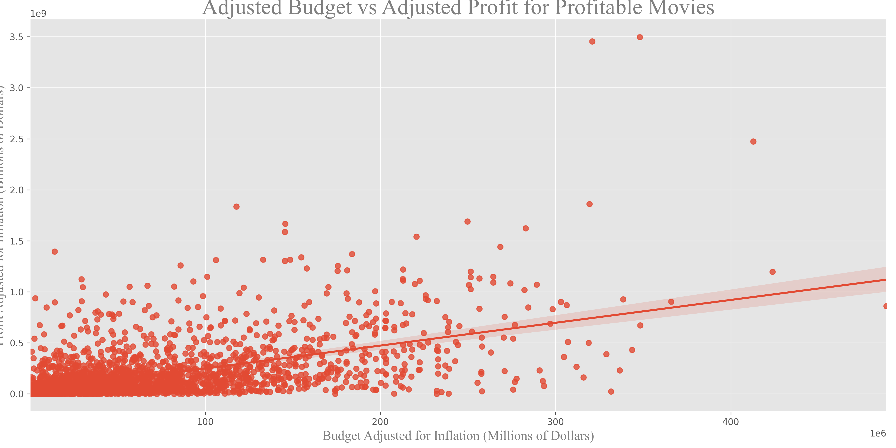
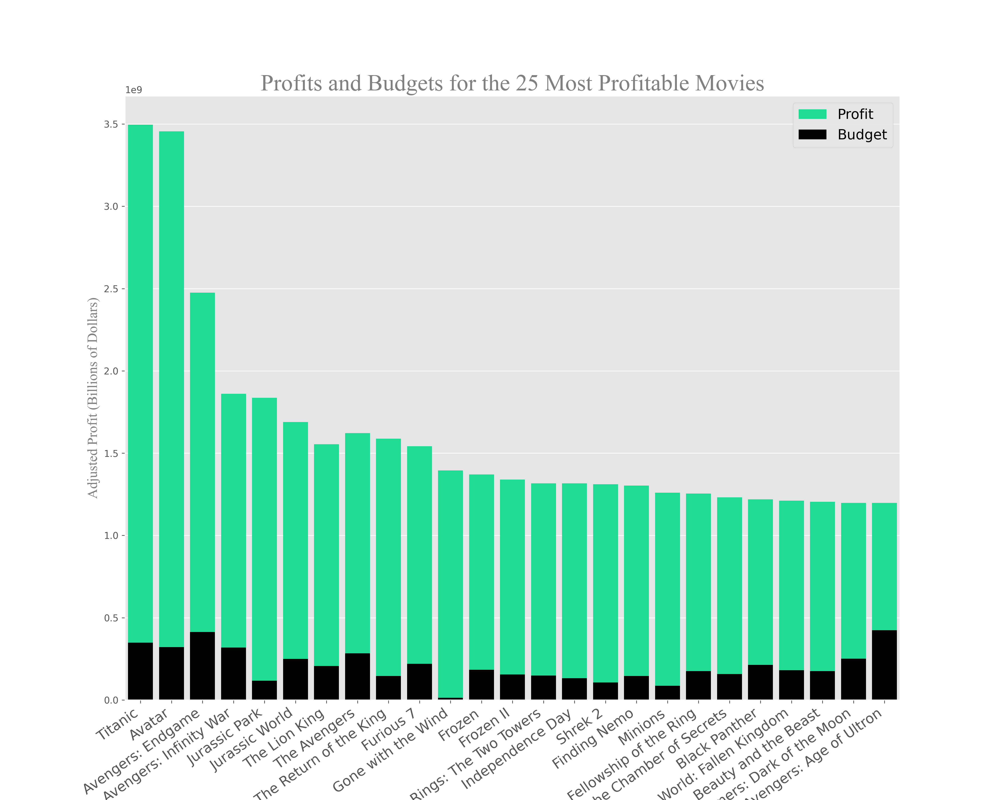

**Conclusion**: The company should budget approximately $82,250,000 per movie, targeting a profit margin of 80% to align with top-performing films.

## Question 2: Which Movie Genres Are Most Commonly Produced, and Does Quantity Equate to Higher Net Profits?
We analyze genre frequency using the `genre_budgets_df` DataFrame, grouping by genre to count movies:

```python
m_by_genre = genre_budgets_df.groupby('Genre', as_index=False)['Movie'].count().sort_values(by='Movie', ascending=False)
```

A bar plot shows drama, comedy, and action as the most produced genres. We then calculate median net profit and profit margin per genre to assess financial success, using the median to mitigate outlier effects. A percentage breakdown of total net profit by genre informs budget allocation.

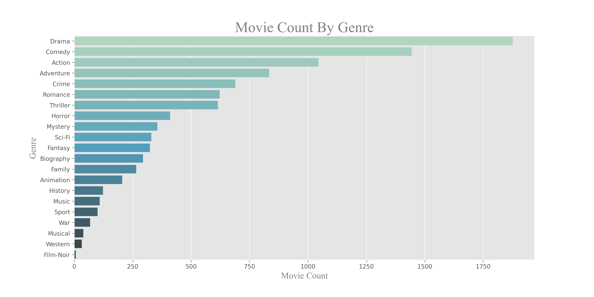
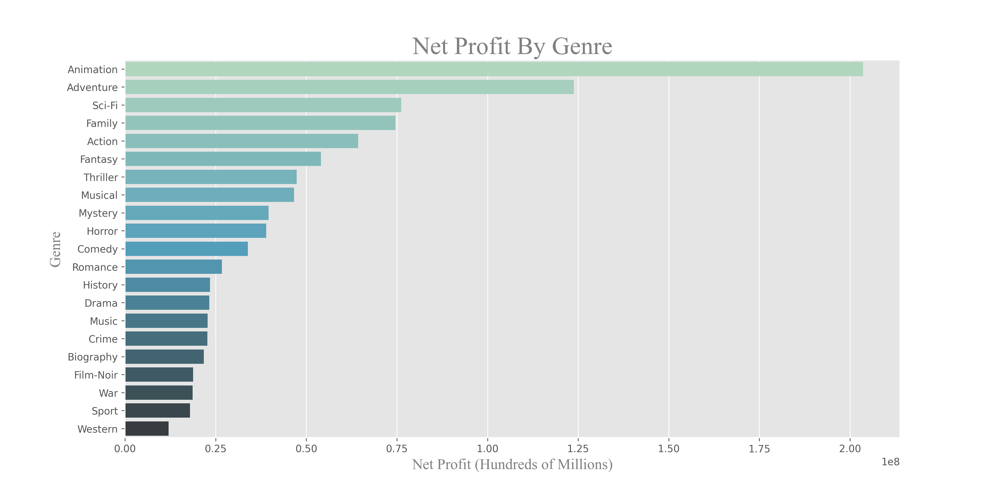
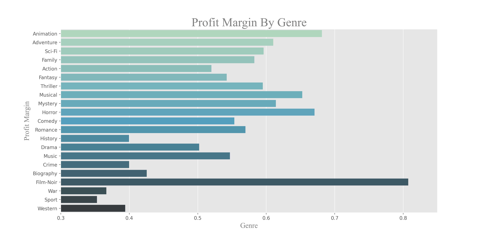
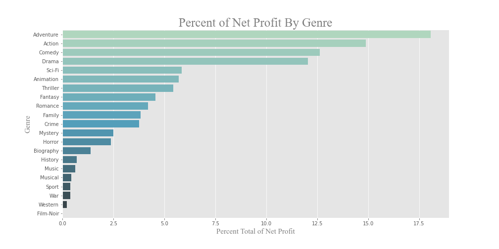

**Conclusion**: Animation, adventure, and sci-fi yield the highest median net profits, with animation, horror, and musicals excelling in profit margins. The company should prioritize these genres, particularly animation and sci-fi, due to lower competition and high returns.

## Question 3: What Is the Best Time of Year to Release a Movie?
We convert release dates in `imdb_budgets_df` to datetime objects and extract the month to analyze release patterns. A count of movies by month reveals December and October as peak release periods. Grouping by month, we assess median net profit and profit margin to identify profitable release windows. A line plot of net profit by month for key genres highlights seasonal trends.

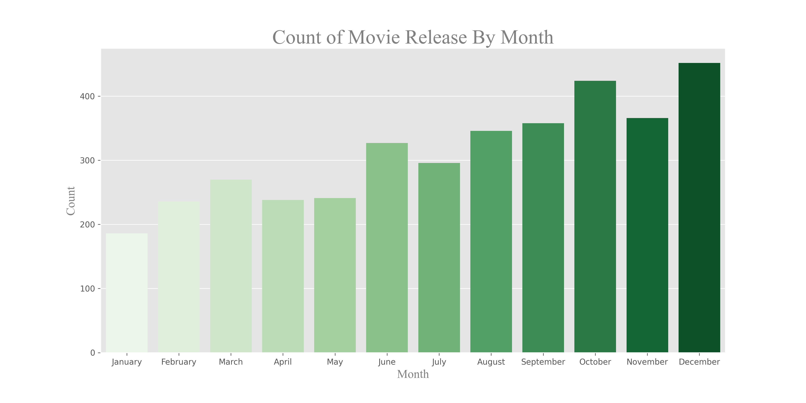
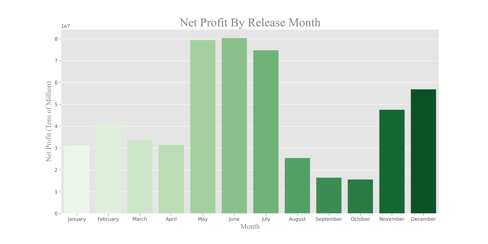
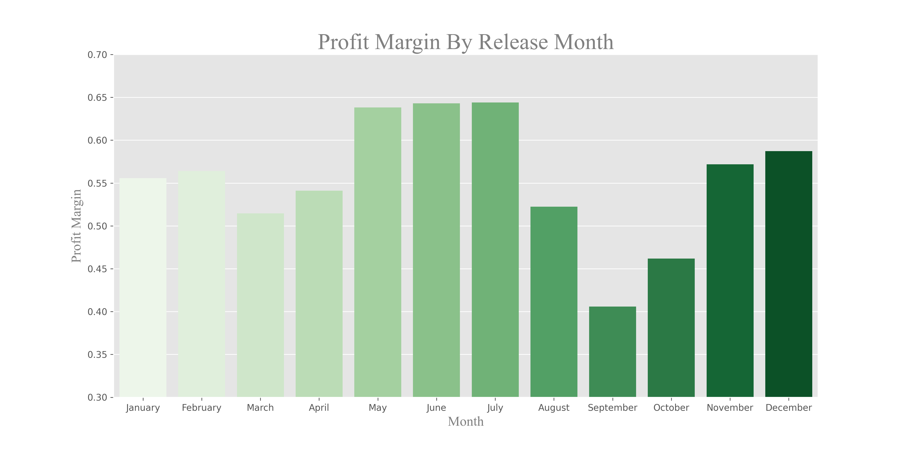
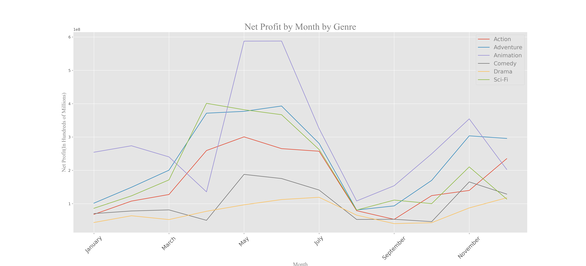

**Conclusion**: The company should release most movies, especially animation, during the summer months (May–July) for maximum profitability. Adventure, drama, and comedy films can also succeed in November, but summer remains the optimal period.

## Question 4: Which Actors and Directors Add the Most Value?
We evaluate actors and directors using a Value Above Replacement (VAR) metric, which compares their average net profit to the industry average. For actors, we filter `actors_df` to include those in 10 or more films:

```python
actor_counts = actors_df['value'].value_counts()
actor_list = actor_counts[actor_counts >= 10].index.tolist()
actors_df = actors_df[actors_df['value'].isin(actor_list)]
actor_total = actors_df.groupby(['value'], as_index=False)['Net Profit'].mean().sort_values(by='Net Profit', ascending=False)
actor_total['VAR'] = (actor_total['Net Profit'] / actor_total['Net Profit'].mean())
```

For directors, we apply the same process using `directors_df`, filtering for those with 5 or more films. Bar plots visualize the top 25 actors and directors by VAR.

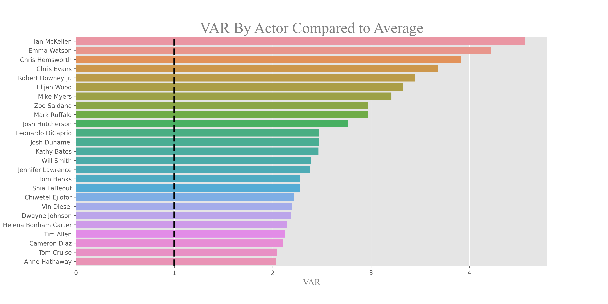
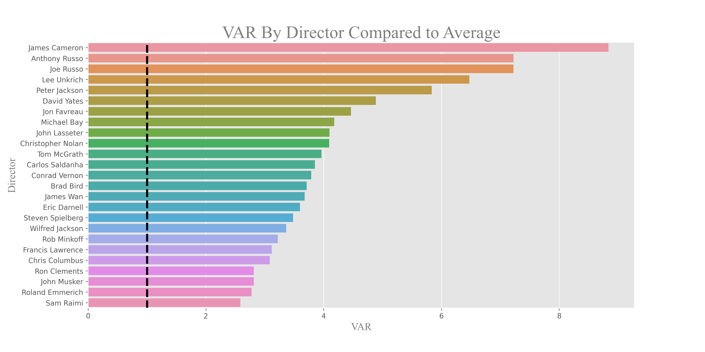

**Conclusion**: The company should prioritize casting actors and directors with a VAR score of at least 1.0, such as Ian McKellen or James Cameron, as they consistently elevate a film’s financial success.

## Question 5: How Much Should You Spend to Win an Oscar?
We join `imdb_budgets_df` and `awards_df` to explore budget correlations with Oscar wins. A box plot of budgets for Oscar-nominated movies shows most fall below $100 million. We analyze win rates to determine a nomination threshold, finding that movies with at least three nominations have a median win rate of 39.2%. Filtering for this threshold, we re-evaluate budget distribution, using the median to account for outliers.

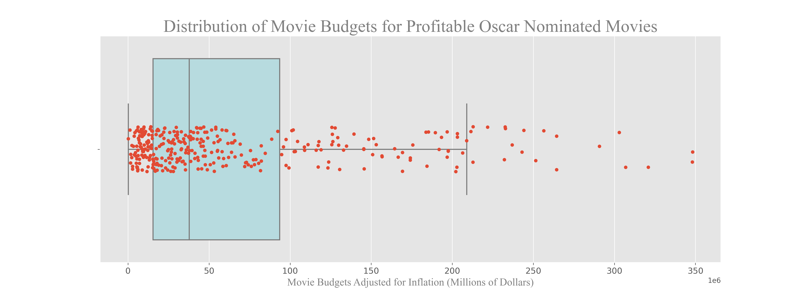
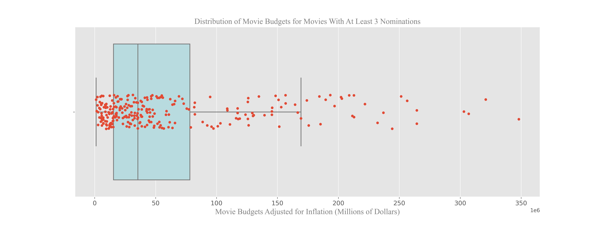

**Conclusion**: The company should allocate at least $35,465,000 to produce a movie with strong Oscar potential, aligning with the median budget of films with multiple nominations.

## Question 6: What Impact Do Runtime and Movie Ratings Have on Net Profit, Profit Margin, and IMDb Rating?
Focusing on G, PG, PG-13, and R ratings in `imdb_budgets_df`, we count movies per rating and calculate median net profit, profit margin, and IMDb scores. A box plot illustrates profit distribution by rating. We then merge genre and rating data to create a pivot table, visualizing total net profit by genre and rating.

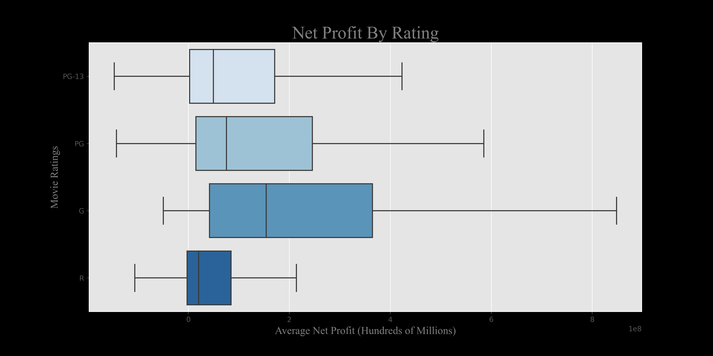
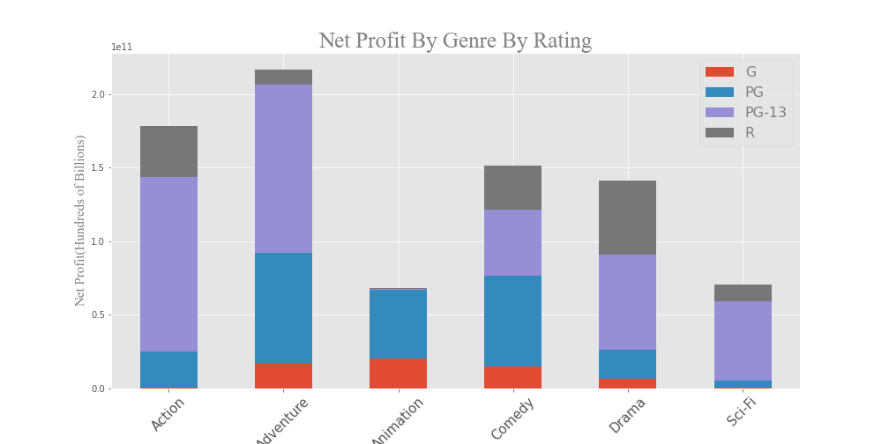

For runtime, we compute Pearson correlations with net profit and profit margin, finding a weak positive correlation (0.223) with profit.

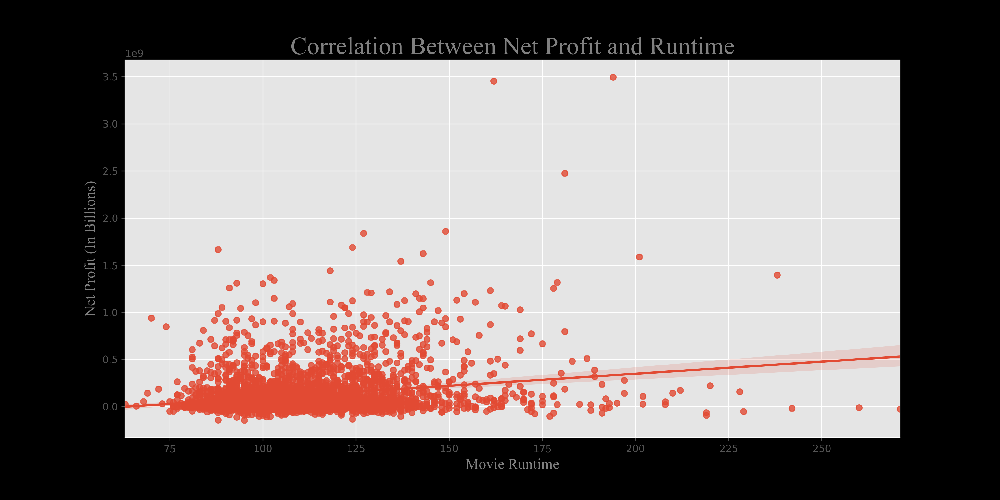

**Conclusion**: The company should target G or PG ratings for animation films and PG-13 for other genres to maximize profitability. Runtime has minimal impact on financial success, allowing flexibility in film length.

## Question 7: What Should the Company Determine as the Baseline for Sustainable Success?
Using the `studiobudgets_df` DataFrame, we group by studio and calculate median profit margin and net profit, focusing on the top 25 studios to reflect major players. Bar plots highlight performance across these studios, with the median profit margin serving as a benchmark.

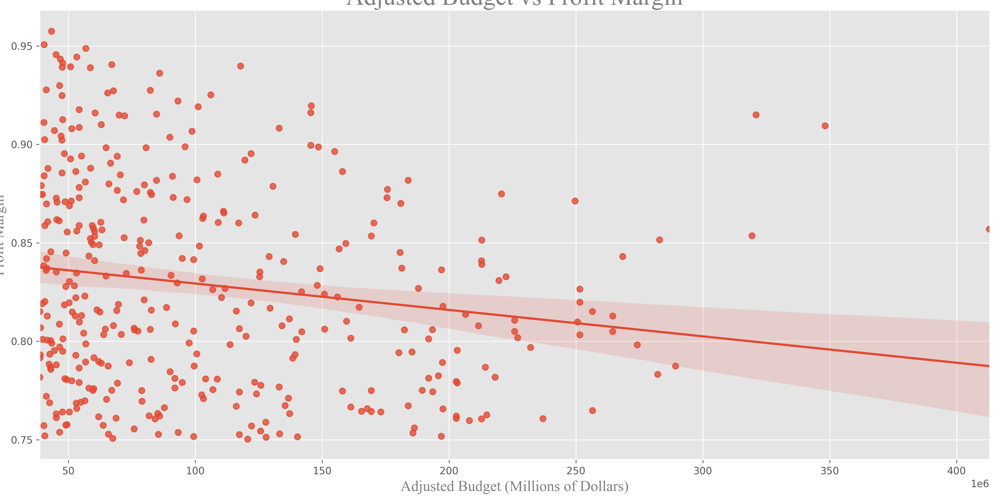
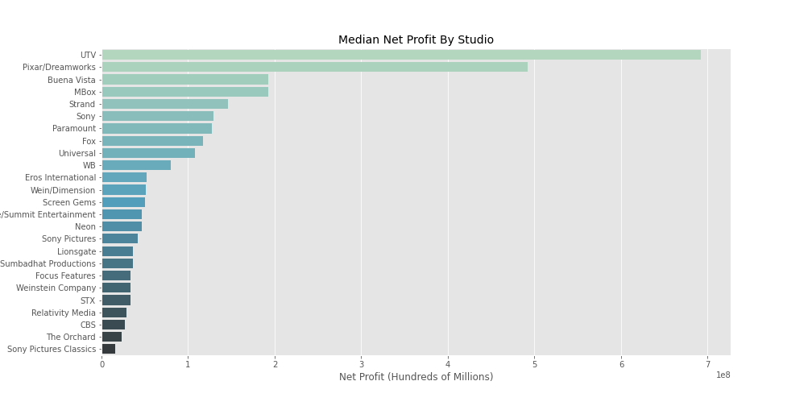

**Conclusion**: The company should aim for a 66% profit margin and a net profit exceeding $50 million per movie to compete with top studios and ensure sustainable success.

## Question 8: Which Competitors’ Best Practices Should the Company Emulate?
We enhance `theaters_df` by adding a `dollars_per_theater` column to assess domestic gross efficiency:

```python
theaters_df['dollars_per_theater'] = theaters_df['total_dom_gross($)'] / theaters_df['max_theaters']
```

Grouping by studio, we compare average domestic gross per theater. A scatter plot of maximum theaters versus gross reveals trends, with Disney excelling. Joining `theaters_df` with `awards_df` yields 66 movies, where Disney (22 films) and Warner Bros. (15 films) dominate. Disney’s higher gross per theater ($78,797) and Oscar win rate (60%) make it the standout.

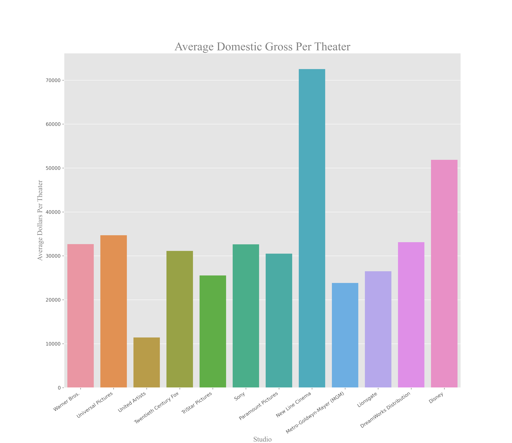
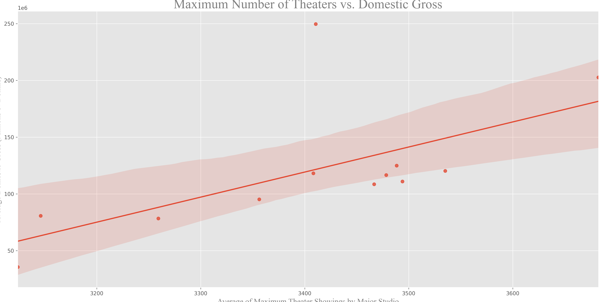

**Conclusion**: The company should study Disney’s best practices, targeting a maximum of 3,818 theaters per movie at peak release to optimize domestic gross and awards success.

## File Structure and Outputs
The analysis generates various files stored in the following directory structure:
- **images/**: Contains charts, graphs, and visualizations (e.g., `BudgetVProfit.png`, `Screenshot_2025-07-09_180812.png`).
- **data/**: Stores raw datasets (e.g., `movie_release_dates.csv`).
- **notebooks/**: Houses the Jupyter Notebook (`Movie_Industry_Analysis.ipynb`).
- **(root)**: Includes this overview (`README.md`).

## Final Thoughts
This analysis provides a comprehensive roadmap for the company’s entry into the movie industry. By budgeting strategically, prioritizing high-return genres, timing releases effectively, selecting top talent, and emulating Disney’s proven strategies, the company can achieve both financial success and critical acclaim.
```
